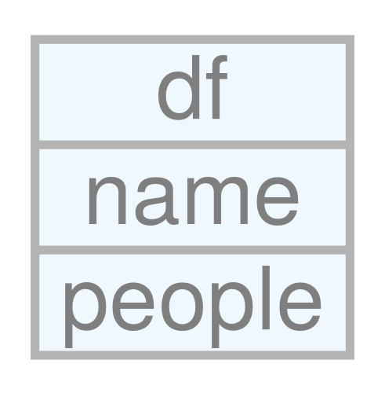

<!-- README.md is generated from README.Rmd. Please edit that file -->
schemeR
=======

[](http://www.repostatus.org/#wip)

The goal of schemeR is to visualize SQLite databases.

Installation
------------

You can install schemeR from github with:

``` r
# install.packages("devtools")
devtools::install_github("jsta/schemeR")
```

Usage
-----

This is a basic example:

``` r
library(schemeR)

dt <- dplyr::lahman_sqlite()

dt_names <- get_names(dt)
dt <- lapply(dt_names, function(x) get_columns(dplyr::tbl(dt, x)))
names(dt) <- dt_names
```

``` r
# http://graphviz.org/content/datastruct
# https://rich-iannone.github.io/DiagrammeR/graphviz_and_mermaid.html

library(DiagrammeR)

ndf <-
  create_node_df(
    rankdir = "LR",
    n = 2,
    label = c("name| value 1| value 2| value 3| value 4", 3),
    type = c("type_1", "type_1"),
    shape = c("record", "record"),
    values = c(1, 2))
graph <- create_graph(nodes_df = ndf)
# get_node_df(graph)
# render_graph(graph)

dot_txt <- generate_dot(graph)
dot_txt <- gsub("neato,", "neato, rankdir = 'LR',", dot_txt)

grViz(diagram = dot_txt)
```

<!--html_preserve-->

<script type="application/json" data-for="htmlwidget-10d7df1f8e6027cb85f6">{"x":{"diagram":"digraph {\n\ngraph [layout = neato, rankdir = \"LR\",\n       outputorder = edgesfirst]\n\nnode [fontname = Helvetica,\n     fontsize = 10,\n     shape = circle,\n     fixedsize = true,\n     width = 0.5,\n     style = filled,\n     fillcolor = aliceblue,\n     color = gray70,\n     fontcolor = gray50]\n\nedge [len = 1.5,\n     color = gray40,\n     arrowsize = 0.5]\n\n  \"1\" [label = \"name| value 1| value 2| value 3| value 4\", shape = \"record\"] \n  \"2\" [label = \"3\", shape = \"record\"] \n}","config":{"engine":"dot","options":null}},"evals":[],"jsHooks":[]}</script>
<!--/html_preserve-->
``` r

# https://github.com/rich-iannone/DiagrammeR/issues/133
```


