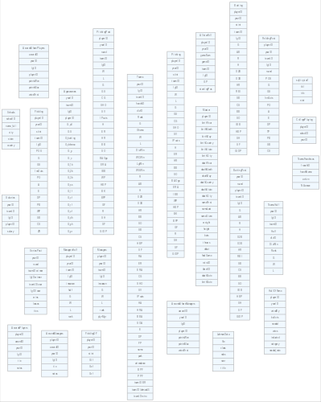

<!-- README.md is generated from README.Rmd. Please edit that file -->
schemeR
=======

[](http://www.repostatus.org/#wip)

The goal of schemeR is to visualize SQLite databases.

Installation
------------

You can install schemeR from github with:

``` r
# install.packages("devtools")
devtools::install_github("jsta/schemeR")
```

Usage
-----

This is a basic example:

### SQLite

``` r
library(schemeR)

db <- dplyr::lahman_sqlite()
res <- schemeR::render_sqlite(db)
schemeR::export_svg(res, "images/sqlite_example.png")
```



### data.frame

``` r

df <- data.frame(
          "name" = 1:4,
          "people" = c("bob", "jim", "beatrice", "ann"))

res <- schemeR::render_df(df)
schemeR::export_svg(res, "images/df_example.png")
```


References
----------

<http://graphviz.org/content/datastruct>

<https://rich-iannone.github.io/DiagrammeR/graphviz_and_mermaid.html>

<https://github.com/rich-iannone/DiagrammeR/issues/133>
